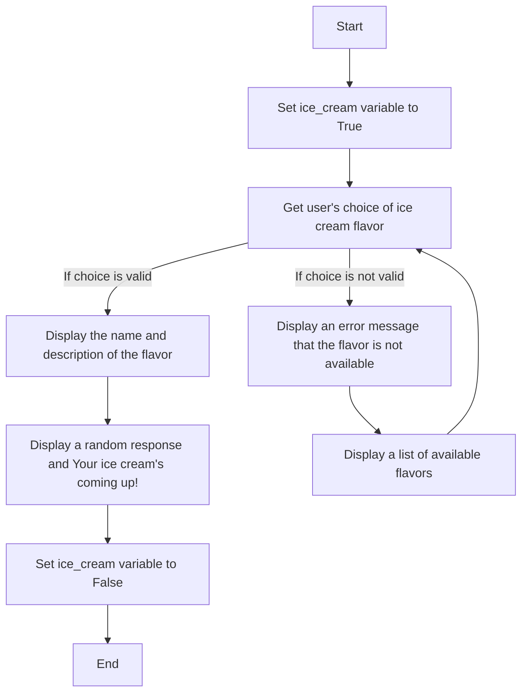

# Week 6
* You will develop a simple intake program. 
* The goal of the program is to provide system arguments for various flavors of ice cream.
* You are then to develop code which will display the inventory of ice-cream to the user so they can select. 
* You’ll also need to test if their selection is a part of the inventory and determine if their selection is valid or not valid.  

Starting Code
------
```
import sys #importing the sys function
flavors = sys.argv[0:] #establishing the flavors list from the system
flavors = [element.upper() for element in flavors] #parsing the inputs of flavors into upper case for comparison 
print(f"These are the flavor's of ice-cream we have to offer {flavors}") #displaying the preloaded ice cream flavors
place_order = True #setting the indexing variable to True to use within While loop
while place_order == True: #starting execution of while loop

#take input from user for their name
#take input from user of their choice of ice cream
#convers the string of ice cream to upper case for comparison later
#develop an if statement which will begin by searching for the user’s choice of ice cream within the flavors list and determine if there is a match
#if there is a match display “your order will be right up!” and set the place_order flag to False
#if there is not a match, display the list of options again and let the user know to try one more time
```


### Hands On Solution
- This week's Hands On uses an ice cream shop flavor dictionary and a while statment. It asks the user what flavor they would like and responds with the flavor plus the full defintion and a message.
- [Hands On Solution](HandsOn/module3.py)
### HOA Notes
- [Hoa Notes](HandsOn/Week6-HOA-Notes.ipynb)
- There's some tech humor this weeek,
-------

### Psuedo Code
```psuedo
Import the random module
Create a dictionary of ice cream flavors
Define welcome message
Define what flavor message
Set ice_cream variable to True

while ice_cream is True:
    Get user's choice of ice cream flavor
    If the choice is valid:
        Display the name and description of the flavor
        Display a random response and "Your ice cream's coming up!"
        Set ice_cream variable to False
    Else:
        Display an error message that the flavor is not available
        Display a list of available flavors

```
### Flowchart




